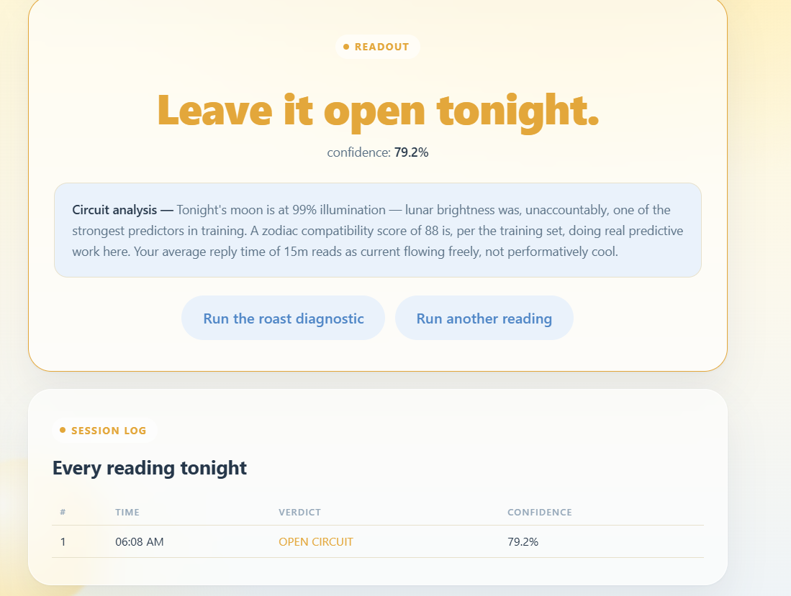
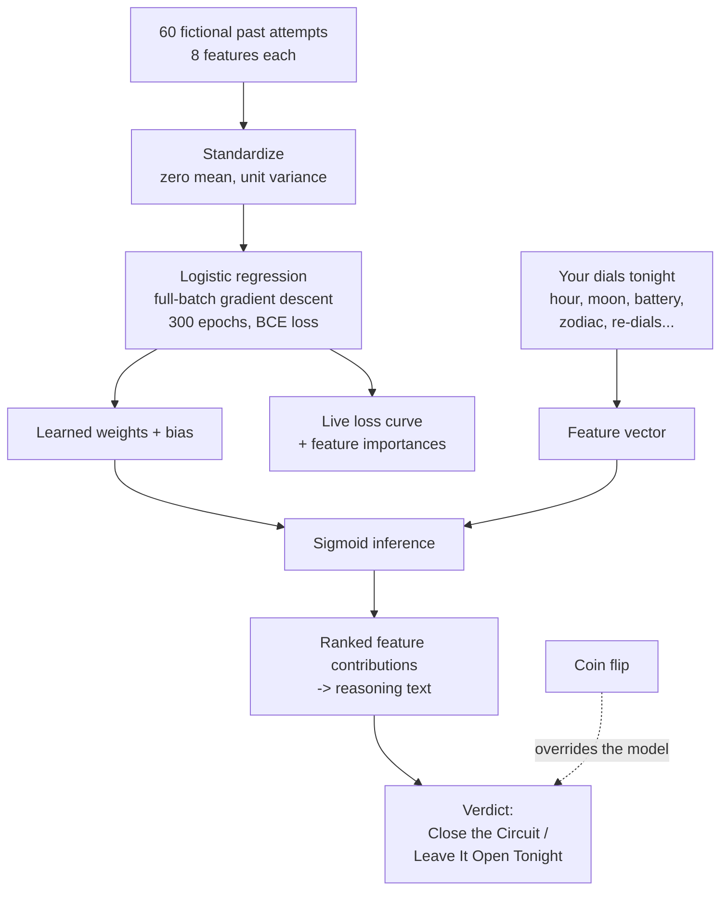

# The Heart Circuit 🫀⚡

## Basic Details
### Induvidual Team

### Team Members
- Team Lead: Abhishek Jijo, Sahrdaya College of Engineering and Technology, Kodakara


### Project Description
The Heart Circuit is a browser-based "should I text her?" oracle that trains a real logistic regression model, live, in front of you, on sixty entirely fictional past attempts to close the loop. Set your dials — hour, mood, moonlight, battery, zodiac compatibility — and let a breadboard of pure longing decide your fate.

### The Problem (that doesn't exist)
Nobody has ever needed a rigorously engineered decision-support system to know whether to send "hey" at 1am. And yet, here we are, treating a crush like a control system that just needs the right feedback loop.

### The Solution (that nobody asked for)
We built an actual gradient-descent-trained logistic regression classifier — knobs, sliders, a battery gauge, an analog clock, a live loss curve and all — that ingests your vibes as numerical features and outputs a verdict: **Close the Circuit** or **Leave It Open Tonight**. For scientific integrity (and because love isn't actually predictable), the final call is secretly a coin flip.

## Technical Details
### Technologies/Components Used
For Software:
- HTML5, CSS3, JavaScript (vanilla, no build step)
- Logistic regression implemented from scratch (manual gradient descent, no ML libraries)
- SVG for the rotary knobs, wire slider, analog clock, and live loss chart
- Glassmorphism / iOS-inspired UI, all in a single self-contained `.html` file

For Hardware:
- None — this is 100% a software "circuit," no actual soldering was harmed

### Implementation
For Software:

# Installation
No installation needed — it's a single static HTML file.
```bash
git clone https://github.com/abhishek524671-alt/heart_circuit.git
cd heart_circuit
```

# Run
```bash
# just open it in a browser
open index.html        # macOS
start index.html       # Windows
xdg-open index.html    # Linux
```
Or double-click the file. No server, no dependencies, no npm install required.

### Project Documentation
For Software:

# Screenshots (Add at least 3)

*The model training live on 60 synthetic past "closures," with a real-time loss curve falling
over 300 epochs and a feature-importance breakdown showing which wires actually carry the current.*


*The input panel — analog hour-of-night clock, rotary re-dial knob, copper wire sliders, a
draggable capacitor for battery charge, and zodiac selects — where you confess your situation
to the machine.*


*The final verdict: Close the Circuit or Leave It Open Tonight, with a reasoning breakdown
naming the three features that moved the decision most, and a roast diagnostic.*

# Diagrams


*Data → training → inference → verdict. Every stage is real except the last arrow: the model
genuinely trains and genuinely ranks which of your inputs mattered, then a coin flip decides
the actual answer. The reasoning you get is a true explanation of a prediction that was never
consulted.*

### Project Demo
# Video
[Add your demo video link here]
*Demonstrates setting the dials, training the model live, and getting roasted by your own heart circuit.*

# Additional Demos
[Add any extra demo materials/links]

## Team Contributions
- Abhishek Jijo: [Specific contributions]

---
Made with ❤️ at TinkerHub Useless Projects


